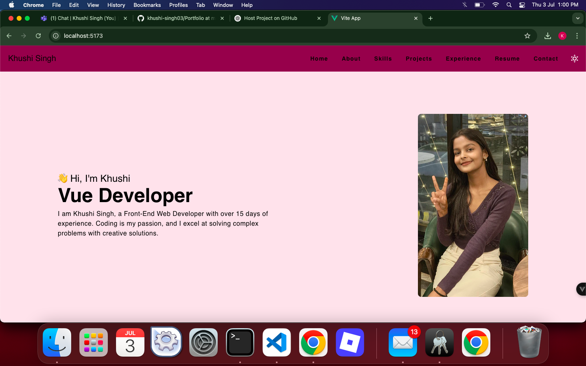
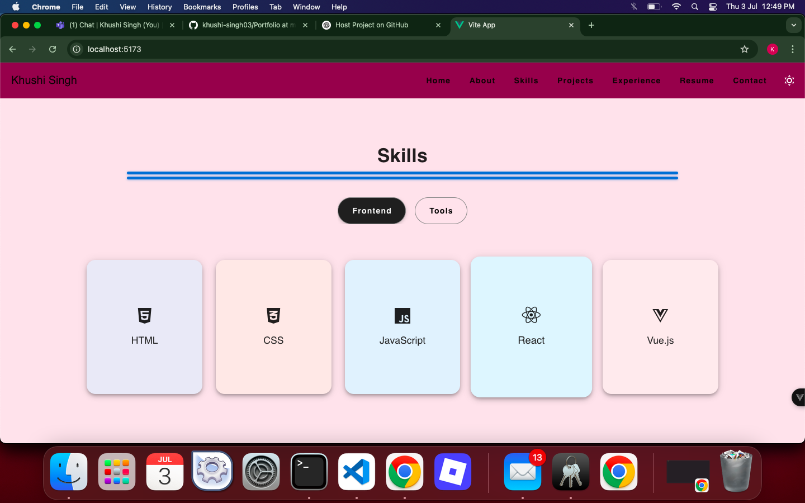

# My Vue + Vite Portfolio

A responsive and modern personal portfolio built using Vue 3, Vuetify, and Vite.

This template should help get you started developing with Vue 3 in Vite.

Here is my 1st look of my Portfolio Website :-

## Screenshots 🖼️

### 🏠 Home



### 🛠️ Skills  



## Recommended IDE Setup

[VSCode](https://code.visualstudio.com/) + [Volar](https://marketplace.visualstudio.com/items?itemName=Vue.volar) (and disable Vetur).

## Customize configuration

See [Vite Configuration Reference](https://vite.dev/config/).

## Project Setup

```sh
npm install
```

### Compile and Hot-Reload for Development

```sh
npm run dev
```

### Compile and Minify for Production

```sh
npm run build
```
